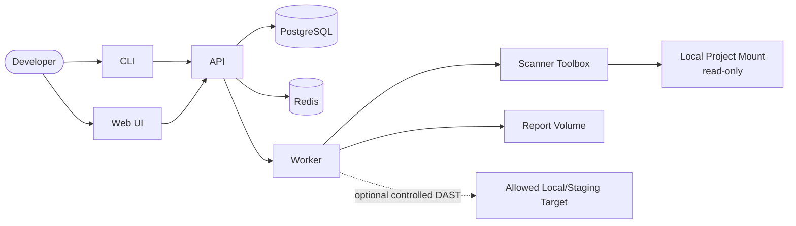

# Architecture

## Purpose and Context

`SecurityPreflight` is a local security preflight tool for checking application
projects before commit, release, staging deployment, production handoff, or a
formal security review. It gives developers an evidence-oriented answer to:
"is this project ready for security review, or are there obvious blockers that
should be fixed first?"

- Primary users: developers and technical owners running local checks on their
  own projects.
- Core workflows: register a local project, detect its technology stack, run a
  scan profile, normalize findings, evaluate a release gate, and export
  Markdown/JSON evidence.
- Security scope: SAST, secret scanning, dependency scanning, OpenAPI checks,
  documentation compliance, configuration checks, and controlled local DAST.
- Non-goals: exploit automation, brute force testing, denial-of-service tests,
  internet-wide scanning, third-party target scanning, SOC replacement, or
  replacing a formal penetration test.

## System Boundary

The system runs on a developer MacBook through Docker Desktop. Source code and
reports stay local by default. Network access is disabled for scanner workloads
unless a profile explicitly requires it, for example vulnerability database
updates or a controlled DAST target.

## Main Components

- `apps/web`: Next.js UI for projects, scan runs, findings, reports,
  toolchain health, and settings.
- `apps/api`: Fastify REST API, OpenAPI JSON-first contract, input validation,
  persistence, scan orchestration endpoints, and report download endpoints.
- `apps/worker`: scan orchestration, guarded plan consumption, internal check
  execution, timeout handling, evidence capture, finding normalization, and
  report generation.
- `apps/cli`: thin local client for stack lifecycle, doctor checks, scans,
  reports, and automation-friendly exit codes.
- `packages/core`: shared types, Zod schemas, detector logic, finding model,
  severity mapping, gate evaluation, redaction utilities, and audit events.
- `packages/scanners`: adapters and parsers for Gitleaks, Semgrep, Trivy,
  Syft, Grype, OSV Scanner, Checkov, Redocly OpenAPI validation,
  documentation compliance, and controlled ZAP baseline evidence.
- `packages/report`: Markdown, JSON, and later SARIF/SBOM report generation.
- `packages/config`: global and per-project configuration schemas.

## Data Flows

1. A user registers a local project path through the UI or CLI.
2. The API stores project metadata and asks the detector to infer the stack from
   repository files such as `package.json`, `Dockerfile`, `pyproject.toml`, or
   `Package.swift`.
3. A scan request creates a `ScanRun` and queues work in Redis.
4. The API builds a scan execution plan with command argument arrays, evidence
   paths, read-only project mounts, network mode, and guardrail decisions.
5. The worker consumes unblocked queued plans and executes supported internal
   checks plus external scanner commands through the configured runner. Missing
   tools, non-zero scanner failures without parseable findings, or disabled
   runner policy create blocking tooling evidence.
6. Check outputs are redacted, stored under the report volume, parsed, and
   normalized into the shared `Finding` model.
7. The gate evaluator maps findings to `PASS`, `WARNING`, `FAIL`, or `ERROR`.
8. Markdown and JSON reports are generated and exposed through the API, UI, and
   CLI.

## Databases and Storage

- PostgreSQL stores projects, scan profiles, scan runs, findings, risk
  exceptions, settings, and audit events.
- Redis stores queue state, worker coordination data, and short-lived scan
  progress/events.
- Report storage is a Docker volume mapped to a local directory such as
  `~/SecurityPreflight/reports`.
- Raw tool outputs are treated as sensitive evidence. They must be redacted
  before persistence where practical, and report access remains local by
  default.

## External Systems and Integrations

- Required local dependencies: Docker Desktop, Docker Compose, PostgreSQL,
  Redis, and scanner tooling packaged in the worker/scanner-toolbox images.
- Optional network access: vulnerability database updates for dependency
  scanners and explicitly allowed local/staging DAST targets.
- STRATOS UI alignment: the Web UI follows STRATOS application shell and token
  conventions. Direct `@voldzi/stratos-ui` package consumption is deferred until
  registry-based access is configured without committing package credentials.
- Future integrations: DefectDojo/Security Assurance Platform export, CI/CD
  templates, SARIF upload, SBOM workflows, and macOS Keychain support through a
  host-side CLI helper.

## Authentication and Authorization

- MVP is single-user and local-only. It does not provide multi-user identity or
  remote access.
- The API is intended for localhost access from the Web UI and CLI. If remote
  access is introduced later, authentication and authorization must be designed
  before enabling it.
- Audit events still record who initiated actions where the local OS user or
  CLI context is available.

## Deployment Model

- Primary deployment is Docker Desktop on a developer MacBook.
- The stack is started with Docker Compose and exposes the Web UI at
  `http://localhost:8780`.
- Scanner execution uses the worker container by default and can use the
  constrained scanner-toolbox Docker runner when explicitly configured. The
  default Compose worker does not mount `/var/run/docker.sock`.
- If future image or compose scanning requires Docker socket access, that mode
  must be explicit, documented as higher risk, and isolated from the default
  profile.

## Penetration Testing Boundary

SecurityPreflight may include controlled DAST and penetration-test readiness
checks for systems owned by the user. It must not implement automated exploit
chains, brute force attacks, denial-of-service tests, authentication bypass
attempts, data exfiltration, or scanning of third-party/public targets. Active
DAST is disabled by default and can only run against localhost,
`127.0.0.1`, `host.docker.internal`, or explicitly allowlisted staging hosts.
The `controlled-dast-local` profile plans OWASP ZAP baseline checks only after
both the profile and request explicitly enable active DAST.
