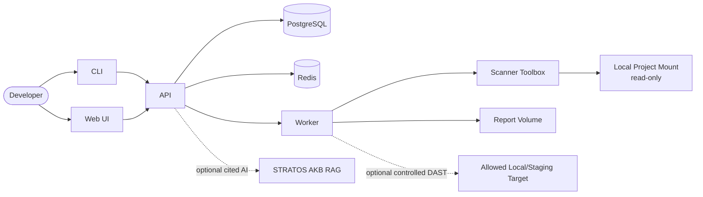

# Architecture

## Purpose and Context

`SecurityPreflight` is a local security preflight tool for checking application
projects before commit, release, staging deployment, production handoff, or a
formal security review. It gives developers an evidence-oriented answer to:
"is this project ready for security review, or are there obvious blockers that
should be fixed first?"

- Primary users: developers and technical owners running local checks on their
  own projects.
- Core workflows: register a local project, detect its technology stack, run a
  scan profile, normalize findings, evaluate a release gate, and export
  Markdown/JSON/PDF/PPTX evidence.
- Security scope: SAST, secret scanning, dependency scanning, OpenAPI checks,
  documentation compliance, configuration checks, and controlled local DAST.
- Non-goals: exploit automation, brute force testing, denial-of-service tests,
  internet-wide scanning, third-party target scanning, SOC replacement, or
  replacing a formal penetration test.

## System Boundary

The system runs on a developer MacBook through Docker Desktop. Source code and
reports stay local by default. Network access is disabled for scanner workloads
unless a profile explicitly requires it, for example vulnerability database
updates or a controlled DAST target.

## Main Components

- `apps/web`: Next.js UI for projects, scan runs, findings, reports,
  toolchain health, and settings.
- `apps/api`: Fastify REST API, OpenAPI JSON-first contract, input validation,
  persistence, scan orchestration endpoints, report export endpoints, and the
  server-side AKB bridge.
- `apps/worker`: scan orchestration, guarded plan consumption, internal check
  execution, timeout handling, evidence capture, finding normalization, and
  report generation.
- `apps/cli`: thin local client for stack lifecycle, doctor checks, scans,
  reports, and automation-friendly exit codes.
- `packages/core`: shared types, Zod schemas, detector logic, finding model,
  severity mapping, gate evaluation, redaction utilities, and audit events.
- `packages/scanners`: adapters and parsers for Gitleaks, Semgrep, Trivy,
  Syft, Grype, OSV Scanner, Checkov, Redocly OpenAPI validation,
  documentation compliance, and controlled ZAP baseline evidence.
- `packages/report`: Markdown, JSON, SARIF, central envelope, and report generation.
  The API additionally builds STRATOS-style PDF and PPTX exports from redacted
  report evidence.
- `packages/config`: global and per-project configuration schemas.

## Data Flows

1. A user registers a local project path through the UI or CLI.
2. The API validates that the project path is absolute, mounted inside
   `PROJECTS_ROOT_CONTAINER`, and points to a directory. It stores project
   metadata in `REPORTS_PATH/projects.json` and infers the stack from bounded
   file-name inspection such as `package.json`, `Dockerfile`, `pyproject.toml`,
   or `Package.swift`.
3. A scan request creates a `ScanRun` and queues work in Redis.
4. The API builds a scan execution plan with command argument arrays, evidence
   paths, read-only project mounts, network mode, and guardrail decisions.
5. The worker consumes unblocked queued plans and executes supported internal
   checks plus external scanner commands through the configured runner. Missing
   tools, non-zero scanner failures without parseable findings, or disabled
   runner policy create blocking tooling evidence.
6. Check outputs are redacted, stored under the report volume, parsed, and
   normalized into the shared `Finding` model.
7. The gate evaluator maps findings to `PASS`, `WARNING`, `FAIL`, or `ERROR`.
8. Markdown and JSON reports are generated and exposed through the API, UI, and
   CLI.
9. The API can build PDF and PPTX exports from redacted report evidence when a
   user explicitly requests a report export.
10. If configured, the API can ask AKB RAG cited questions scoped to a scan run.
   SecurityPreflight sends metadata and tags only; AKB owns document text,
   chunks, embeddings, citations, and RAG audit.

## Databases and Storage

- PostgreSQL stores scan run status, step results, finding metadata, finding
  triage state, and scan/finding audit events. In production on
  `docker.home.cz`, the connection is supplied through `DATABASE_URL` and
  routed to `haproxy.home.cz:5000`.
- Redis stores queue state and worker coordination data.
- Report storage is a Docker volume mapped to a local directory such as
  `~/SecurityPreflight/reports`.
- Raw tool outputs are treated as sensitive evidence. They are redacted into
  report files where practical and are not copied into PostgreSQL; the database
  keeps bounded metadata and audit state.

## External Systems and Integrations

- Required local dependencies: Docker Desktop, Docker Compose, PostgreSQL,
  Redis, and scanner tooling packaged in the API, worker, and scanner-toolbox
  images so UI/CLI doctor checks and queued scan execution report the same
  healthcare-required toolchain.
- Optional network access: vulnerability database updates for dependency
  scanners and explicitly allowed local/staging DAST targets.
- STRATOS UI alignment: the Web UI consumes `@voldzi/stratos-ui` through GitHub
  Packages and composes the dashboard from shared STRATOS shell, navigation,
  global topbar, command center, table, badge, metric, list, and form
  primitives. Package credentials must be supplied through local or CI registry
  configuration, never committed.
- Localization: the Web UI is bilingual Czech/English. Czech is the default
  language, the topbar exposes a CS/EN switch aligned with other STRATOS apps,
  and the language preference is stored only in browser `localStorage`. Scanner
  evidence, profile IDs, report file names, and API-origin diagnostic strings
  remain technical audit artifacts and are not rewritten.
- STRATOS report pattern: completed scan evidence can be exported as base64 PDF
  or PPTX payloads with filename, MIME type, hash, generation time, and
  parameters metadata.
- STRATOS AKB integration: optional server-side AKB RAG calls provide cited AI
  answers. Browser clients never call internal AKB services directly, and
  SecurityPreflight does not store prompts, answers, chunks, embeddings, or
  document text outside AKB.
- Assurance integrations: SecurityPreflight writes SARIF for DefectDojo import,
  can post SARIF to DefectDojo when explicitly enabled, imports
  Greenbone/OpenVAS and OpenSCAP evidence, and can dispatch supported web
  scanner commands to a hardened external scanner VPS.
- Future integrations: richer DefectDojo product/test synchronization,
  Greenbone task orchestration, and macOS Keychain support through a host-side
  CLI helper.

## Authentication and Authorization

- Development may run with authentication disabled for localhost-only use.
- Production defaults to OIDC when `APP_ENV=production`; the API fails closed if
  OIDC issuer, client id, or audience is missing. JWKS is either configured
  explicitly or derived from the Keycloak issuer.
- STRATOS Keycloak integration uses realm `stratos`, public PKCE client
  `security-preflight-web`, public path `https://stratos.zeleznalady.cz/sp`,
  and repository-managed provisioning in
  `infra/keycloak/ensure-security-preflight-client.sh`.
- OIDC JWTs are verified server-side with RS256/JWKS and role claims from
  `realm_access` and `resource_access`.
- Coarse RBAC separates authenticated read access from operator actions such as
  queueing scans, exporting reports, central ingest, and AKB questions.
- `shared-token` mode exists only as a controlled transition path. It should be
  replaced by STRATOS/Keycloak OIDC for shared healthcare use.
- Per-project authorization and durable audit event storage remain planned
  production hardening work.

## Deployment Model

- Primary deployment is Docker Desktop on a developer MacBook.
- The stack is started with Docker Compose and exposes the Web UI at
  `http://localhost:8780`.
- Scanner execution uses the worker container by default and can use the
  constrained scanner-toolbox Docker runner when explicitly configured. The
  default Compose worker does not mount `/var/run/docker.sock`.
- If future image or compose scanning requires Docker socket access, that mode
  must be explicit, documented as higher risk, and isolated from the default
  profile.

## Penetration Testing Boundary

SecurityPreflight may include controlled DAST and penetration-test readiness
checks for systems owned by the user. It must not implement automated exploit
chains, brute force attacks, denial-of-service tests, authentication bypass
attempts, data exfiltration, or scanning of third-party/public targets. Active
DAST is disabled by default and can only run against localhost,
`127.0.0.1`, `host.docker.internal`, or explicitly allowlisted staging hosts.
The `controlled-dast-local` profile plans OWASP ZAP baseline checks only after
both the profile and request explicitly enable active DAST.
